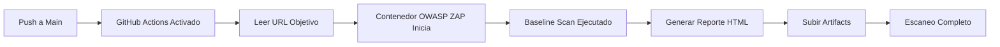

# Web DAST - Pruebas de Seguridad Automatizadas con OWASP ZAP


Pipeline automatizado de **Dynamic Application Security Testing (DAST)** para aplicaciones web usando **OWASP ZAP** integrado con GitHub Actions. Este proyecto demuestra las mejores prácticas de DevSecOps mediante la implementación de pruebas de seguridad continuas en workflows de CI/CD.

## Tabla de Contenidos

- [Descripción General](#descripción-general)
- [Características](#características)
- [Cómo Funciona](#cómo-funciona)
- [Requisitos Previos](#requisitos-previos)
- [Uso](#uso)
- [Resultados del Escaneo](#resultados-del-escaneo)
- [Configuración del Workflow](#configuración-del-workflow)
- [Tecnologías Utilizadas](#tecnologías-utilizadas)
- [Consideraciones de Seguridad](#consideraciones-de-seguridad)
- [Recursos Adicionales](#recursos-adicionales)

---

## Descripción General

Este repositorio contiene un **pipeline de CI/CD** que realiza automáticamente escaneos de seguridad en aplicaciones web utilizando **OWASP ZAP (Zed Attack Proxy)**. El scanner identifica vulnerabilidades web comunes basadas en el **OWASP Top 10** incluyendo:

- SQL Injection
- Cross-Site Scripting (XSS)
- Security Misconfigurations
- Sensitive Data Exposure
- XML External Entities (XXE)
- LFI
- Y más...

---

## Características

- Escaneo automatizado activado en cada push o PR
- Integración con OWASP ZAP para detección completa de vulnerabilidades
- Reportes HTML generados automáticamente
- Workflow de GitHub Actions para integración CI/CD sin fricciones
- Almacenamiento de artifacts para resultados de escaneos
- Modo baseline scan para evaluación rápida de vulnerabilidades
- Cobertura del OWASP Top 10

---

## Cómo Funciona



### Flujo del Pipeline:

1. **Trigger**: Push a la rama `main` o ejecución manual del workflow
2. **Setup**: GitHub Actions runner inicia entorno Ubuntu
3. **Objetivo**: Lee la URL objetivo desde `url.txt`
4. **Escaneo**: OWASP ZAP ejecuta baseline security scan
5. **Reporte**: Genera reporte HTML con los hallazgos
6. **Almacenamiento**: Artifacts subidos para revisión

---

## Requisitos Previos

- Repositorio de GitHub con Actions habilitado
- URL de aplicación web objetivo
- Conocimiento básico de conceptos de seguridad web

---

## Uso

### 1. Clonar el Repositorio

```bash
git clone https://github.com/Neivoc/zap-web-dast.git
cd zap-web-dast
```

### 2. Configurar URL Objetivo

Edita el archivo `url.txt` con la URL de tu aplicación web objetivo:

```bash
echo "https://ejemplo.com" > url.txt
```

### 3. Subir Cambios

```bash
git add url.txt
git commit -m "Actualizar URL objetivo"
git push origin main
```

### 4. Monitorear el Workflow

Navega a la pestaña **Actions** en GitHub para monitorear el progreso del escaneo.

### 5. Descargar Reporte

Una vez completado:
1. Ve a la ejecución del workflow
2. Desplázate a la sección **Artifacts**
3. Descarga el reporte HTML

---

## Resultados del Escaneo

El scanner OWASP ZAP genera un **reporte HTML** que contiene:

- **Resumen** de vulnerabilidades encontradas
- **Niveles de riesgo**: Crítico, Alto, Medio, Bajo, Informativo
- **Hallazgos detallados** con:
  - Descripción de la vulnerabilidad
  - URLs afectadas
  - Evidencia
  - Recomendaciones de remediación
  - Referencias CWE

---

## Configuración del Workflow

El workflow de GitHub Actions está definido en `.github/workflows/main.yml`.

### Componentes Principales:

- **Trigger**: `push` a la rama main, `workflow_dispatch` para ejecuciones manuales
- **Runner**: `ubuntu-latest`
- **OWASP ZAP Action**: Baseline scan oficial de ZAP
- **Tipo de Escaneo**: Baseline 
- **Formato de Reporte**: HTML
- **Retención de Artifacts**: 7 días

### Opciones de Personalización:

Puedes modificar el workflow para:
- Cambiar profundidad del escaneo (baseline → full scan)
- Agregar autenticación
- Configurar políticas de escaneo
- Integrar con notificaciones Slack/Email
- Establecer security gates (fallar en hallazgos de alto riesgo)

---

## Tecnologías Utilizadas

| Tecnología | Propósito |
|-----------|----------|
| **OWASP ZAP** | Scanner de seguridad dinámico |
| **GitHub Actions** | Automatización CI/CD |
| **Docker** | Escaneo containerizado |
| **Ubuntu** | Entorno del runner |
| **HTML** | Generación de reportes |

---

## Consideraciones de Seguridad

- **Nunca escanear** sistemas en producción sin autorización
- **Nunca hacer commit** de credenciales sensibles o API keys
- **Siempre revisar** los resultados del escaneo antes de compartir
- **Usar responsablemente** - solo escanea aplicaciones que posees o tienes permiso para probar
- **Rate limiting** - Algunos objetivos pueden bloquear escaneos agresivos

### Mejores Prácticas:

1. Probar contra **entornos de staging/desarrollo** primero
2. Notificar a tu equipo antes de ejecutar escaneos
3. Revisar y clasificar los hallazgos apropiadamente
4. Integrar los hallazgos en tu proceso de gestión de vulnerabilidades

---

## Recursos Adicionales

- [Documentación OWASP ZAP](https://www.zaproxy.org/docs/)
- [OWASP Top 10](https://owasp.org/www-project-top-ten/)
- [Documentación GitHub Actions](https://docs.github.com/es/actions)
- [Mejores Prácticas DevSecOps](https://www.devsecops.org/)
